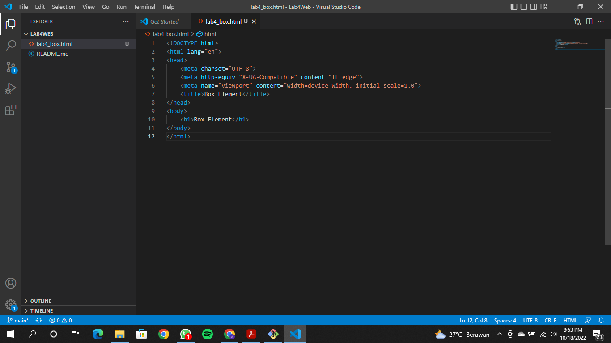
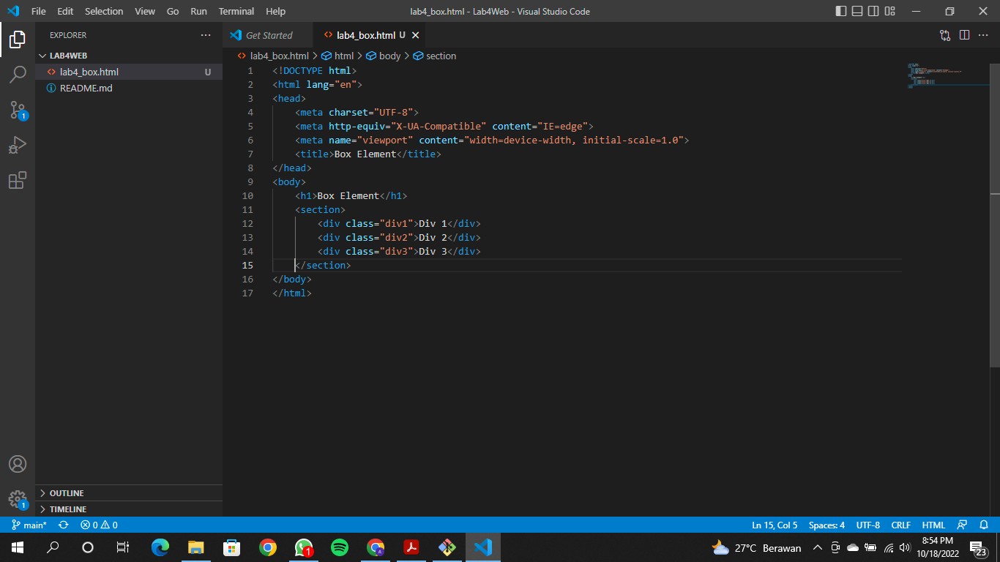
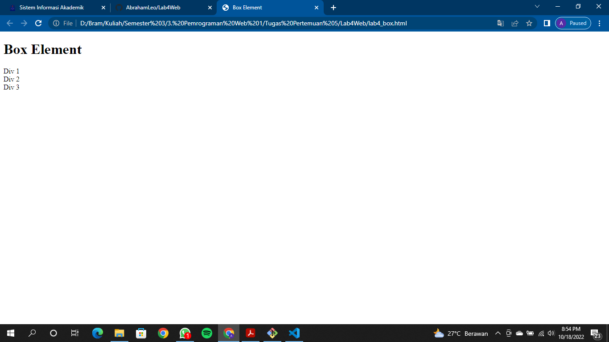
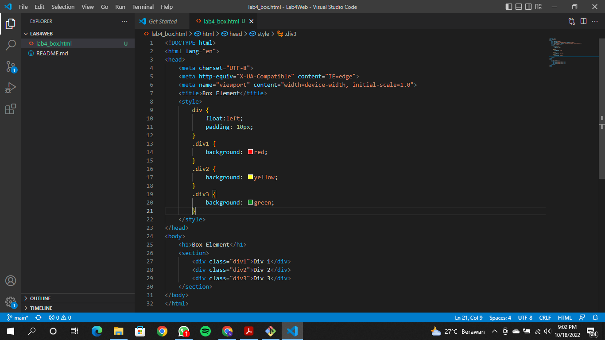
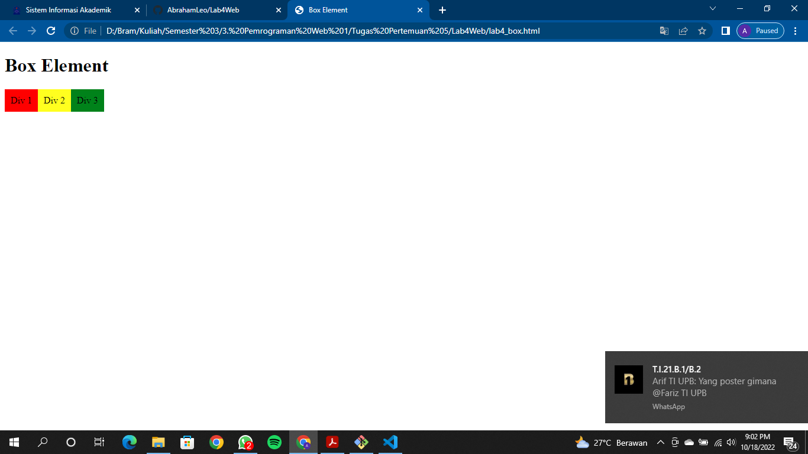
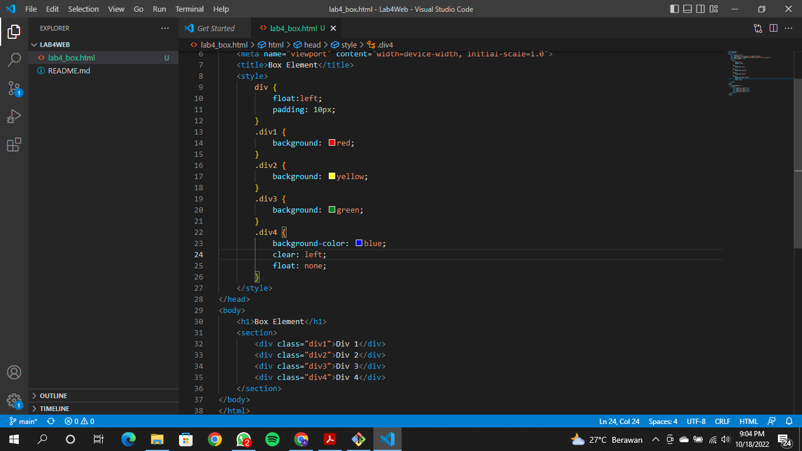

# Lab4Web

## Membuat Box Element
Persiapan membuat dokumen HTML dengan nama file lab4_box.html seperti berikut.
  
### Membuat Box Element
Kemudian tambahkan kode untuk membuat box element dengan tag div seperti berikut.
  
Kemudian hasilnya seperti ini
  
### CSS Float Property
Selanjutnya tambahkan deklarasi CSS pada head untuk membuat float element, seperti berikut.
  
Kemudian hasilnya seperti ini
  
### Mengatur Clearfix Element
Clearfix digunakan untuk mengatur element setelah float element. Property clear digunakan untuk mengaturnya.
Tambahkan element div lainnya seteleah div3 dan atur property clear pada CSS seperti berikut.
  
Selanjutnya buka browser dan refresh kembali.
  