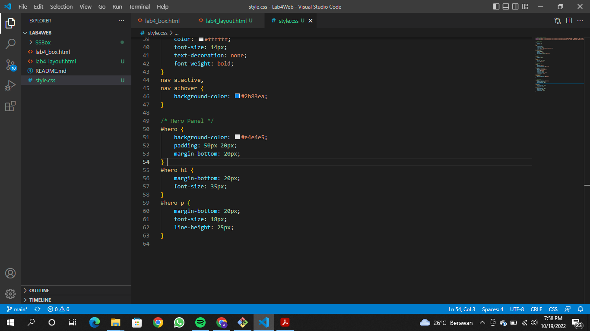
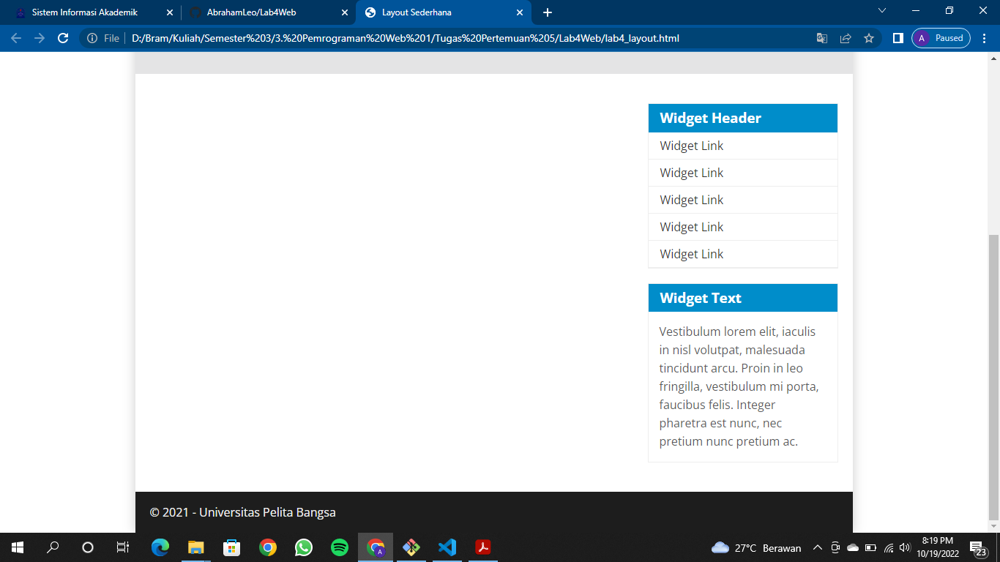

# Lab4Web

## Membuat Box Element
Persiapan membuat dokumen HTML dengan nama file lab4_box.html seperti berikut.
  
  
Kemudian hasilnya seperti ini
  
### CSS Float Property
Selanjutnya tambahkan deklarasi CSS pada head untuk membuat float element, seperti berikut.
  
Kemudian hasilnya seperti ini
  
### Mengatur Clearfix Element
Clearfix digunakan untuk mengatur element setelah float element. Property clear digunakan untuk mengaturnya.
Tambahkan element div lainnya seteleah div3 dan atur property clear pada CSS seperti berikut.
  
Selanjutnya buka browser dan refresh kembali.
  

## Membuat Layout Sederhana
Buat folder baru dengan nama lab4_layout, kemudian buatlah file baru didalamnya dengan nama lab4_layout.html, dan file css dengan nama style.css.
  
Kemudian tulis kode berikut.
  
Kemudian buka browser dan lihat hasilnya.
  
Kemudian tambahkan kode CSS untuk membuat layoutnya.
  
Kemudian lihat hasilnya pada browser.
  
### Membuat Navigasi
Kemudian selanjutnya mengatur navigasi.
  
Kemudian lihat hasilnya.
  
### Membuat Hero Panel.
Selanjutnya membuat hero panel. Tambahkan kode HTML dan CSS seperti berikut.
  
  
Kemudian lihat hasilnya pada browser.
  
### Mengatur Layout Main dan Sidebar
Selanjutnya mengatur main content dan sidebar, tambahkan CSS float.
  
Kemudian lihat hasilnya pada browser.
  
### Membuat Sidebar Widget
Kemudian selanjutnya menambahkan element lain dalam sidebar.
  
Kemudian tambahkan CSS.
  
Kemudian lihat hasilnya pada browser.
  
### Mengatur Footer
Selanjutnya mengatur tampilan footer. Tambahkan CSS untuk footer.
  
Kemudian lihat hasilnya pada browser.
  
### Menambahkan Elemen lainnya pada Main Content
  
Kemudian tambahkan CSS.
  
Lihat hasilnya dibrowser.
  
### Menambahkan Content Artikel
Selanjutnya membuat content artikel. Tambahkan HTML berikut pada main content.
  
Kemudian tambahkan CSS.
  
Lihat hasilnya dibrowser.
  